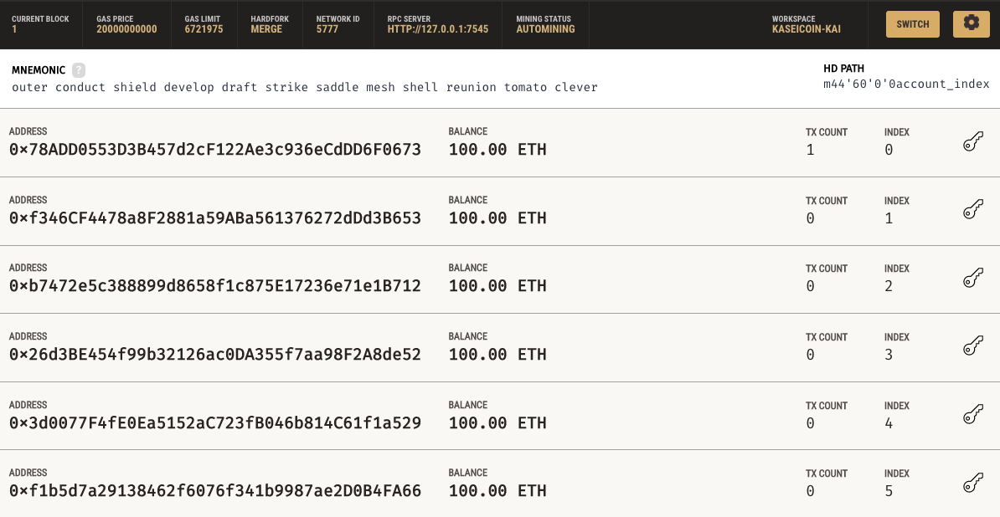
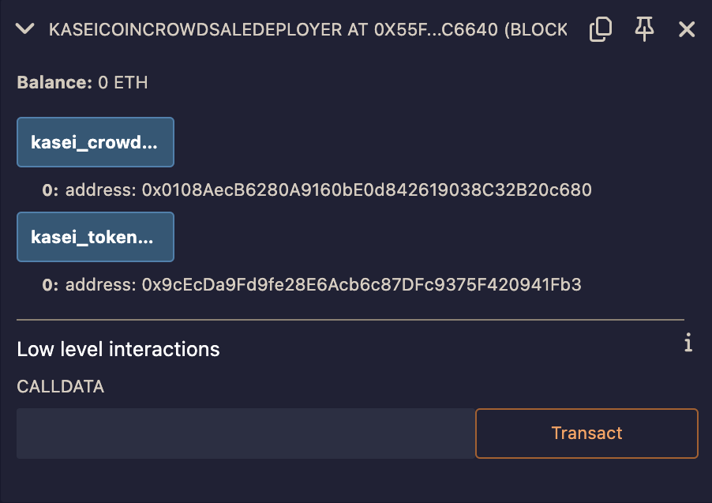
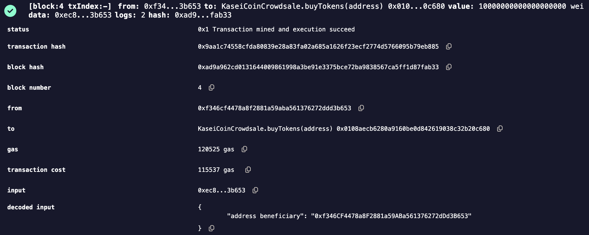
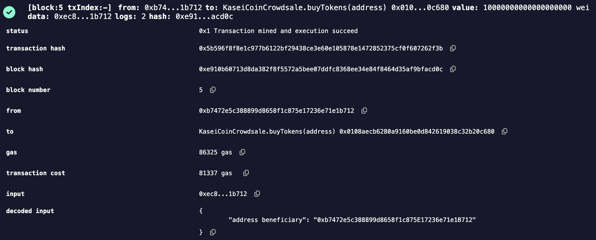
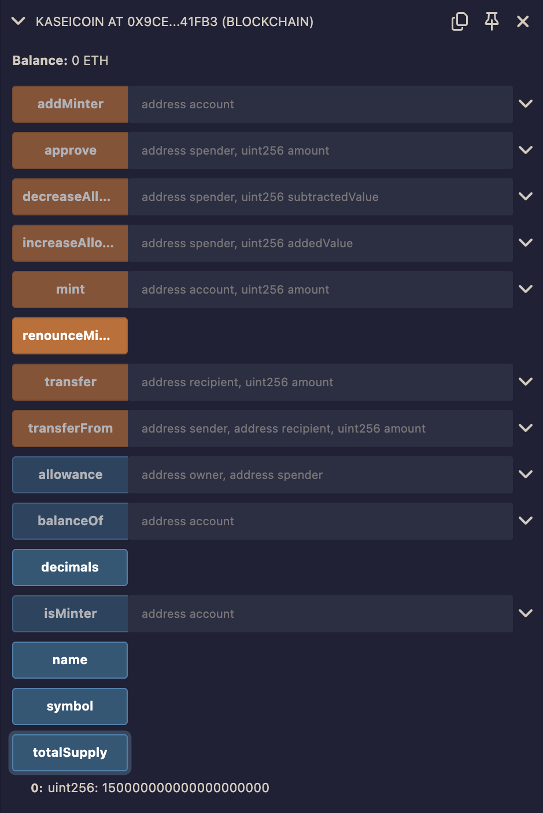
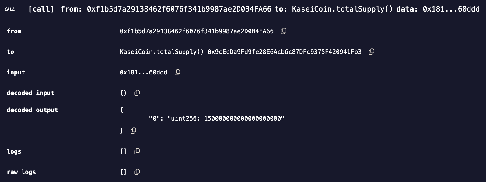
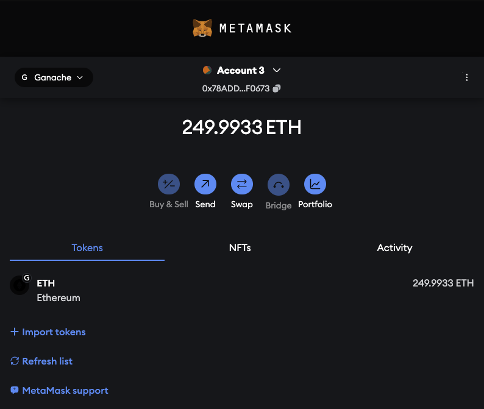

# KaseiCoin (KAI) Crowdsale Project

## Introduction

The KaseiCoin Crowdsale project is a blockchain-based application designed to demonstrate the creation, deployment, and management of a custom cryptocurrency using Ethereum smart contracts. This project focuses on the development of an ERC-20 token named KaseiCoin and its distribution through a crowdsale. The project leverages various Ethereum development tools, including Solidity, Remix, Ganache, and MetaMask, to create a comprehensive decentralized application (DApp).

## Project Requirements

The key requirements for this project were:

1. **Development of a Custom ERC-20 Token**: We needed to create a cryptocurrency, KaseiCoin, following the ERC-20 token standard.
2. **Implementation of a Crowdsale Contract**: This contract allows investors to purchase KaseiCoin tokens in exchange for Ether (ETH), managing the distribution of the tokens.
3. **Integration with Ethereum Development Tools**: The project was designed to be deployed and tested using tools like Remix, Ganache, and MetaMask, providing a full-stack blockchain development experience.
4. **Automation of the Deployment Process**: To simplify the process, a deployment script (`KaseiCoinCrowdsaleDeployer.sol`) was created to automate the deployment of both the token and crowdsale contracts.

## Technologies Used

This project relies on several key technologies within the Ethereum ecosystem:

### Solidity

- **What it is**: Solidity is a statically-typed programming language specifically designed for developing smart contracts that run on the Ethereum Virtual Machine (EVM).
- **How it was used**: Solidity was used to write the smart contracts for KaseiCoin and the associated crowdsale. The contracts were written, tested, and compiled within the Remix IDE before being deployed to a local blockchain.

### Remix (JavaScript VM)

- **What it is**: Remix is an online integrated development environment (IDE) that provides a user-friendly interface for writing, compiling, and deploying Solidity smart contracts.
- **How it was used**: Remix was used for the development and initial testing of the Solidity contracts. Its built-in JavaScript VM allowed us to simulate Ethereum transactions and test the contracts in a controlled environment before deploying them to a local blockchain.

### Ganache

- **What it is**: Ganache is a personal Ethereum blockchain used to test smart contracts in a local development environment. It allows developers to simulate a blockchain on their local machine, providing a controlled environment for testing.
- **How it was used**: Ganache was used to simulate the Ethereum blockchain on the local machine. It provided a safe and controlled environment to deploy the smart contracts and test the crowdsale functionalities. Ganache's interface also allowed us to monitor transactions, manage accounts, and observe changes in Ether balances as tokens were purchased.

### MetaMask

- **What it is**: MetaMask is a cryptocurrency wallet and gateway to blockchain apps. It's available as a browser extension and mobile app, allowing users to interact with the Ethereum blockchain and manage Ether and ERC-20 tokens.
- **How it was used**: MetaMask was used to manage the Ether and KaseiCoin balances. It was also used to simulate transactions between different accounts, allowing us to verify the successful purchase of KaseiCoin tokens during the crowdsale.

## Developmental Structure

The development of the KaseiCoin Crowdsale project was structured to ensure modularity and ease of deployment. Each contract was designed to handle specific aspects of the project, making the system both robust and scalable.

### Smart Contracts Overview

1. **KaseiCoin.sol**
   - **Purpose**: This contract defines the KaseiCoin token, including its name, symbol, decimals, and total supply. It inherits from the OpenZeppelin libraries `ERC20`, `ERC20Detailed`, and `ERC20Mintable` to ensure compliance with the ERC-20 standard and to allow for minting new tokens.
   - **Key Features**: The contract includes a constructor that initializes the token's details and mints an initial supply of tokens to the deploying account.

```solidity
   constructor(string memory name, string memory symbol, uint256 initial_supply)
       ERC20Detailed(name, symbol, 18)
       public
   {
       mint(msg.sender, initial_supply);
   }
```

### Explanation

This constructor initializes the crowdsale with the rate (tokens per ETH), the wallet to collect ETH, and the token being sold. The deployment logic is handled by a separate deployer contract for simplicity.

### KaseiCoinCrowdsaleDeployer.sol

**Purpose**: This contract automates the deployment of the KaseiCoin and KaseiCoinCrowdsale contracts, streamlining the process and reducing the likelihood of deployment errors.

**Key Features**: The contract creates instances of both the KaseiCoin and KaseiCoinCrowdsale contracts and assigns their addresses to public variables for easy access.

```solidity
constructor(
    string memory name,
    string memory symbol,
    address payable wallet
) public {
    KaseiCoin token = new KaseiCoin(name, symbol, 0);
    kasei_token_address = address(token);

    KaseiCoinCrowdsale crowdsale = new KaseiCoinCrowdsale(1, wallet, token);
    kasei_crowdsale_address = address(crowdsale);

    token.addMinter(kasei_crowdsale_address);
    token.renounceMinter();
}
```

### Explanation

This snippet illustrates the deployment process. The deployer contract creates the KaseiCoin token, assigns its address to a variable, and then creates the crowdsale contract. It sets the crowdsale contract as a minter, allowing it to mint new tokens as they are sold.

## Challenges and Solutions

- **Gas Limit Adjustments**: During the initial deployments, transactions failed due to insufficient gas limits. By adjusting the gas limit settings within Remix and Ganache, we ensured that the contracts had enough gas to execute successfully.
- **Minting and Supply Verification**: Ensuring that the correct number of tokens were minted and distributed required careful handling of the minting function. By automating the process in the constructor of `KaseiCoin.sol`, we eliminated the possibility of errors in token distribution.

## Working App Features

The KaseiCoin Crowdsale project allows users to:

- **Deploy Contracts Seamlessly**: The `KaseiCoinCrowdsaleDeployer.sol` contract simplifies the deployment process, making it easy for users to deploy both the token and crowdsale contracts with a single transaction.
- **Purchase Tokens**: Investors can purchase KaseiCoin tokens using Ether. Each purchase mints new tokens and transfers them to the buyer's account, with the corresponding Ether sent to the designated wallet.
- **Verify Balances and Transactions**: Users can verify their Ether and KaseiCoin balances using MetaMask, ensuring that the transactions are executed correctly and their investments are secured.

## Screenshots Walkthrough

- **Ganache Initial Account Balances**: The initial state of accounts before any contracts are deployed or transactions are made. 
- **Deployment of Contracts**: Screenshots of the deployment process, including the creation of KaseiCoin and the crowdsale contract. 
- **Token Purchase Transactions**: Demonstrating the process of purchasing KaseiCoin tokens through the crowdsale contract. 
- **Supply Verification**: Screenshots showing the verification of token supply after transactions have been completed. 
- **MetaMask Balance Update**: Verifying the Ether and KaseiCoin balances within MetaMask after transactions. 

## Running the Application

### Prerequisites

- **Ganache**: Download and install Ganache to simulate a local Ethereum blockchain.
- **MetaMask**: Install the MetaMask browser extension to manage Ethereum accounts and interact with the blockchain.

### Steps

1. **Setup Ganache**: Launch Ganache and configure it to run on a local blockchain. Ensure the network ID is set to 5777.

2. **Deploy the Contracts**:
   - Open Remix and load the Solidity files (`KaseiCoin.sol`, `KaseiCoinCrowdsale.sol`, `KaseiCoinCrowdsaleDeployer.sol`).
   - Deploy the `KaseiCoinCrowdsaleDeployer.sol` contract first to automate the deployment of the other contracts.
   - Verify that the contracts are deployed correctly by checking the addresses in the transaction logs.

3. **Purchase Tokens**:
   - Interact with the `buyTokens` function within the deployed `KaseiCoinCrowdsale.sol` contract.
   - Use MetaMask to confirm the transaction and verify that the tokens are credited to the buyer's account.

4. **Verify Balances**:
   - Use MetaMask to check the Ether balance before and after transactions.
   - Verify the KaseiCoin balance within the crowdsale contract using the `balanceOf` function.

## Future Improvements

- **User Interface**: Developing a frontend interface would improve user interaction and make the application more accessible.
- **Enhanced Security**: Adding more robust security features to the smart contracts would help protect against potential attacks.
- **Scalability**: Optimizing the smart contracts for larger crowdsales and more complex transactions would make the application suitable for broader use cases.

## Code Explanation and Snippets

### KaseiCoin Token Creation

```solidity
constructor(string memory name, string memory symbol, uint256 initial_supply)
    ERC20Detailed(name, symbol, 18)
    public
{
    mint(msg.sender, initial_supply);
}
```

**Explanation**: This constructor initializes the KaseiCoin token by setting its name, symbol, and initial supply. The initial supply is minted and allocated to the deployer's address.

### Crowdsale Contract Initialization

```solidity
constructor(
    uint256 rate,
    address payable wallet,
    KaseiCoin token
) public Crowdsale(rate, wallet, token) {
    // No additional logic needed; deployment handled by deployer contract
}
```

**Explanation**: This constructor sets up the crowdsale, defining the exchange rate, the wallet to receive funds, and the token being sold. The actual deployment is managed by the `KaseiCoinCrowdsaleDeployer.sol` contract.

### Deployer Contract

```solidity
constructor(
    string memory name,
    string memory symbol,
    address payable wallet
) public {
    KaseiCoin token = new KaseiCoin(name, symbol, 0);
    kasei_token_address = address(token);

    KaseiCoinCrowdsale crowdsale = new KaseiCoinCrowdsale(1, wallet, token);
    kasei_crowdsale_address = address(crowdsale);

    token.addMinter(kasei_crowdsale_address);
    token.renounceMinter();
}
```

**Explanation**: This deployer contract automates the deployment of both the KaseiCoin and KaseiCoinCrowdsale contracts. It simplifies the process by creating both contracts in one transaction and setting the crowdsale contract as the minter of the tokens.

## Conclusion

The KaseiCoin Crowdsale project successfully demonstrates the end-to-end process of creating, deploying, and managing a cryptocurrency using Ethereum smart contracts. By centralizing the deployment logic and ensuring modular contract design, the project showcases the potential of blockchain technology in developing decentralized applications.

**Author**: Alexandr Climenco
